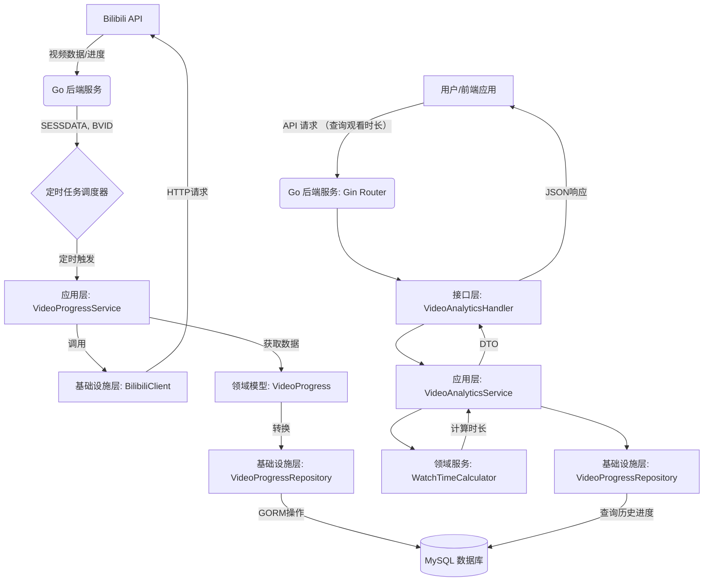
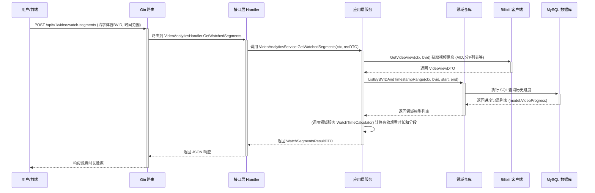

<a name="readme-top"></a>
<h1 align="center">
    
  <br>
  Bilibili Watcher
</h1>

## Bilibili Watcher 是什么

Bilibili Watcher 是一个开源的 Bilibili 视频观看时长追踪与分析工具。它能够自动记录你在 Bilibili 上观看某个视频的时长数据，并通过直观的图表和数据分析，帮助你了解自己的观看习惯和偏好。

### 主要特点

- 📊 **数据可视化**：提供直观的观看时长统计图表
- 🔄 **自动同步**：定时自动同步 Bilibili 观看进度
- 🌙 **深色模式**：支持浅色/深色主题切换
- 📱 **响应式设计**：完美适配桌面和移动设备
- 🔒 **数据安全**：本地部署，数据完全掌握在自己手中

### 使用场景

1. **个人时间管理**
   - 追踪每日/每周/每月的视频观看时长
   - 分析观看习惯，优化时间分配
   - 了解自己最常观看的内容类型

2. **学习进度追踪**
   - 记录学习类视频的观看时长
   - 分析学习效率和专注度
   - 制定合理的学习计划


### 使用截图
|Light|Dark|
|----|----|
|||

## 快速开始

### 使用 Docker（推荐）

1. **克隆项目**
   ```bash
   git clone https://github.com/krisxia0506/bilibili-watcher.git
   cd bilibili-watcher
   ```

2. **配置环境变量**
   ```bash
   cp .env.example .env
   ```
   编辑 `.env` 文件，设置以下必要参数：
   - `BILIBILI_SESSDATA`：你的 Bilibili SESSDATA（用于获取观看进度）
   - `BILIBILI_BVID`：要追踪的视频 BVID

3. **启动服务**
   ```bash
   docker-compose up -d
   ```

4. **访问服务**
   - 前端界面：http://localhost:3000
   - 后端 API：http://localhost:8080

### 获取 Bilibili SESSDATA

1. 登录 [Bilibili](https://www.bilibili.com)
2. 打开浏览器开发者工具（F12）
3. 在 应用（Application）-->存储（Storage） 中找到 Cookies
4. 找到 `SESSDATA` 字段的值并复制，例如：
```
SESSDATA=bb723733%2C1762308022%2Ce456d%2A51CjBn_Tu3wVQ012OWHJ1ZQ7VZLWEADQQbEVSrwACbJSY0oqhw5An18gPkUogW2JU5qzASVmo3cVZmbFdkY3ZJdy12YWlOcElYMW5ydWRQWUoySFhuZU9oeFFaWUI3Q1RhVHI2VWpkLXU3QWFxQWMzSngyT24zNDRPOExmcEV2RldsME1zWERwSVh12345
```

> ⚠️ 注意：请妥善保管你的 SESSDATA，不要分享给他人。

## 核心功能

*   **定时获取进度**: 通过用户配置的 Cron 表达式，定时从 Bilibili API 获取指定UP主最新视频的观看进度。
*   **数据持久化**: 将获取到的观看进度记录（包括播放时长、分P等信息）存储到 MySQL 数据库中。
*   **观看时长分析**: 提供 API 接口，用于计算和查询指定时间范围、特定视频（通过 AID 或 BVID）以及时间间隔（如每日、每周）的有效观看时长。
*   **API 服务**: 基于 Gin 框架提供 RESTful API 接口，方便前端或其他服务调用。
*   **健康检查**: 提供 `/healthz` 端点，用于监控服务运行状态和数据库连接情况。

## 数据处理流程

下图展示了本项目的核心数据处理流程：



## 请求处理时序 (获取观看分段时长)

下图展示了用户请求"获取观看分段时长"接口时的主要交互时序：



## 技术栈

### 后端 (Go)

*   **语言**: Go
*   **Web 框架**: [Gin](https://gin-gonic.com/)
*   **ORM**: [GORM](https://gorm.io/)
*   **数据库**: MySQL 8
*   **架构**: 领域驱动设计 (DDD)，参考 [go-ddd](https://github.com/sklinkert/go-ddd) 实践。
*   **依赖管理**: Go Modules ([go.mod](mdc:go.mod), [go.sum](mdc:go.sum))
*   **配置**: 环境变量
*   **定时任务**: `robfig/cron/v3`
*   **部署**: 推荐 Docker + Docker Compose

### 前端 (Remix)

*   **框架**: [Remix](https://remix.run/docs) ([web/](mdc:web/))
*   **语言**: [TypeScript](https://www.typescriptlang.org/)
*   **UI 库**: [Shadcn UI](https://ui.shadcn.com/)
*   **样式**: [Tailwind CSS](https://tailwindcss.com/)
*   **国际化**: [i18next](https://www.i18next.com/) + [react-i18next](https://react.i18next.com/)
*   **表单处理**: [React Hook Form](https://react-hook-form.com/) + [Zod](https://zod.dev/)
*   **包管理器**: [pnpm](https://pnpm.io/) ([web/package.json](mdc:web/package.json), [web/pnpm-lock.yaml](mdc:web/pnpm-lock.yaml))

## 项目结构

```tree
.
├── cmd/                         # 程序入口 (例如: cmd/main.go)
├── internal/                    # 项目内部代码，不对外暴露
│   ├── application/             # 应用层: Use Cases, Application Services
│   ├── config/                  # 配置加载与管理
│   ├── domain/                  # 领域层: Entities, Value Objects, Domain Events, Repository Interfaces
│   │   ├── model/               # 领域模型
│   │   ├── repository/          # 仓储接口定义
│   │   └── service/             # 领域服务
│   ├── infrastructure/          # 基础设施层
│   │   ├── bilibili/            # Bilibili API 客户端实现
│   │   ├── persistence/         # 持久化实现 (GORM)
│   │   └── scheduler/           # 定时任务调度器实现
│   └── interfaces/              # 接口层 (例如 REST API Handlers)
│       └── api/                 # API 相关
│           └── rest/            # RESTful API 实现
│               └── dto/         # API 数据传输对象
├── pkg/                         # 可共享的库代码 (如果需要，例如通用响应格式)
│   └── response/                # API 标准响应结构
├── sql/                         # SQL schema 定义和迁移脚本
├── web/                         # 前端 Remix 项目根目录
│   ├── app/                     # Remix 应用核心代码
│   │   ├── components/          # React 组件 (包括 Shadcn UI 组件)
│   │   ├── lib/                 # 工具函数、常量等
│   │   ├── locales/             # i18n 翻译文件
│   │   ├── routes/              # 路由文件 (例如 _index.tsx)
│   │   └── styles/              # 全局样式 (Tailwind)
│   ├── public/                  # 静态资源
│   ├── .eslintrc.js             # ESLint 配置文件
│   ├── package.json             # 前端依赖
│   ├── pnpm-lock.yaml           # pnpm 锁定文件
│   ├── remix.config.js          # Remix 配置
│   ├── tailwind.config.js       # Tailwind CSS 配置
│   └── tsconfig.json            # TypeScript 配置
├── Dockerfile.backend           # 后端 Dockerfile
├── Dockerfile.frontend          # 前端 Dockerfile
├── docker-compose.yml           # Docker Compose 配置
├── go.mod                       # Go 模块定义
├── go.sum                       # Go 模块校验和
└── README.md                    # 项目说明文件
```

## 开发规范

*   **日志**: 项目中打印的日志信息应使用英文。
*   **注释**: 代码注释应使用中文，遵循阿里巴巴规范。
*   **编码规范**: 遵循[阿里巴巴 Java 开发手册](https://github.com/alibaba/p3c) (通用原则) 及 Go 社区通用规范。
*   **Git**: 使用 Git 进行版本控制。
*   **Commit Message**: 遵循 Conventional Commits 规范 (例如 `feat:`, `fix:`, `refactor:`, `docs:`, `test:`, `chore:` 等)。

## 本地开发与部署 (Docker)

1.  **环境准备**: 确保已安装 Docker 和 Docker Compose。
2.  **配置**: 复制 `.env.example` 为 `.env`，并根据需要修改其中的环境变量，特别是 Bilibili 相关配置和数据库密码。
3.  **构建与启动**: 在项目根目录运行 `docker-compose up --build -d`。
4.  **访问**:
    *   前端: `http://localhost:3000` (或其他在 `.env` 中配置的端口)
    *   后端 API: `http://localhost:8080` (或其他在 `.env` 中配置的端口)
5.  **停止**: 运行 `docker-compose down`。 

## 参考项目
[哔哩哔哩 - API 收集整理](https://socialsisteryi.github.io/bilibili-API-collect/)


### Star History

## Star History

<a href="https://www.star-history.com/#krisxia0506/bilibili-watcher&Date">
 <picture>
   <source media="(prefers-color-scheme: dark)" srcset="https://api.star-history.com/svg?repos=krisxia0506/bilibili-watcher&type=Date&theme=dark" />
   <source media="(prefers-color-scheme: light)" srcset="https://api.star-history.com/svg?repos=krisxia0506/bilibili-watcher&type=Date" />
   
 </picture>
</a>

<p align="right" style="font-size: 14px; color: #555; margin-top: 20px;">
    <a href="#readme-top" style="text-decoration: none; color: #007bff; font-weight: bold;">
        ↑ 返回顶部 ↑
    </a>
</p>