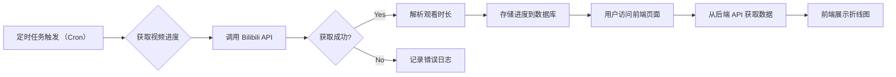

# Bilibili Watcher

本项目旨在创建一个 Bilibili 视频观看时长追踪器，记录并分析每日观看时长。

## 核心功能

1.  **数据获取**: 定时调用 Bilibili API 获取指定用户的视频观看历史和进度。
2.  **数据存储**: 将每日获取到的观看进度持久化到 MySQL 数据库中。
3.  **数据分析**: 计算每日的视频观看时长。
4.  **前端展示**: 通过 Web 界面以折线图等形式展示每日观看时长。

## 系统流程



## 技术栈

### 后端 (Go)

*   **语言**: Go
*   **Web 框架**: [Gin](https://gin-gonic.com/)
*   **ORM**: [GORM](https://gorm.io/)
*   **数据库**: MySQL 8
*   **架构**: 领域驱动设计 (DDD)，参考 [go-ddd](https://github.com/sklinkert/go-ddd) 实践。
*   **依赖管理**: Go Modules ([go.mod](mdc:go.mod), [go.sum](mdc:go.sum))

### 前端 (Remix)

*   **框架**: [Remix](https://remix.run/docs) ([web/](mdc:web/))
*   **语言**: [TypeScript](https://www.typescriptlang.org/)
*   **UI 库**: [Shadcn UI](https://ui.shadcn.com/)
*   **样式**: [Tailwind CSS](https://tailwindcss.com/)
*   **国际化**: [i18next](https://www.i18next.com/) + [react-i18next](https://react.i18next.com/)
*   **表单处理**: [React Hook Form](https://react-hook-form.com/) + [Zod](https://zod.dev/)
*   **包管理器**: [pnpm](https://pnpm.io/) ([web/package.json](mdc:web/package.json), [web/pnpm-lock.yaml](mdc:web/pnpm-lock.yaml))

## 项目结构 (预期)

```
.
├── cmd/                     # 程序入口 (例如: cmd/server/main.go)
├── configs/                 # 配置文件 (例如: configs/config.yaml)
├── internal/                # 项目内部代码，不对外暴露
│   ├── application/         # 应用层: Use Cases, Application Services
│   ├── domain/              # 领域层: Entities, Value Objects, Domain Events, Repository Interfaces
│   │   ├── model/           # 领域模型
│   │   ├── repository/      # 仓储接口定义
│   │   └── service/         # 领域服务
│   └── infrastructure/      # 基础设施层:
│       ├── persistence/     # 持久化实现 (GORM, internal/infrastructure/persistence/db.go)
│       ├── bilibili/        # Bilibili API 客户端 (internal/infrastructure/bilibili/client.go)
│       └── web/             # Web 框架适配 (Gin Handlers, Routers, internal/infrastructure/web/router.go)
├── pkg/                     # 可共享的库代码 (如果需要)
└── web/                     # 前端 Remix 项目根目录
    ├── app/                 # Remix 应用核心代码
    │   ├── routes/          # 路由文件
    │   ├── components/      # React 组件 (包括 Shadcn UI 组件)
    │   ├── lib/             # 工具函数、常量等
    │   ├── styles/          # 全局样式 (Tailwind)
    │   └── locales/         # i18n 翻译文件
    ├── public/              # 静态资源
    ├── package.json         # 前端依赖
    ├── tsconfig.json        # TypeScript 配置
    ├── tailwind.config.js   # Tailwind 配置
    └── remix.config.js      # Remix 配置
├── .gitignore               # Git 忽略文件配置
├── go.mod                   # Go 模块定义
├── go.sum                   # Go 模块校验和
├── Dockerfile.backend       # 后端 Dockerfile
├── Dockerfile.frontend      # 前端 Dockerfile
├── docker-compose.yml       # Docker Compose 配置
└── .env.example             # 环境变量示例
```

## 开发规范

*   **日志**: 项目中打印的日志信息应使用英文。
*   **注释**: 代码注释应使用中文，遵循阿里巴巴规范。
*   **编码规范**: 遵循[阿里巴巴 Java 开发手册](https://github.com/alibaba/p3c) (通用原则) 及 Go 社区通用规范。
*   **Git**: 使用 Git 进行版本控制。
*   **Commit Message**: 遵循 Conventional Commits 规范 (例如 `feat:`, `fix:`, `refactor:`, `docs:`, `test:`, `chore:` 等)。

## 本地开发与部署 (Docker)

1.  **环境准备**: 确保已安装 Docker 和 Docker Compose。
2.  **配置**: 复制 `.env.example` 为 `.env`，并根据需要修改其中的环境变量，特别是 Bilibili 相关配置和数据库密码。
3.  **构建与启动**: 在项目根目录运行 `docker-compose up --build -d`。
4.  **访问**:
    *   前端: `http://localhost:3000` (或其他在 `.env` 中配置的端口)
    *   后端 API: `http://localhost:8080` (或其他在 `.env` 中配置的端口)
5.  **停止**: 运行 `docker-compose down`。 

## 参考项目
[哔哩哔哩 - API 收集整理](https://socialsisteryi.github.io/bilibili-API-collect/)